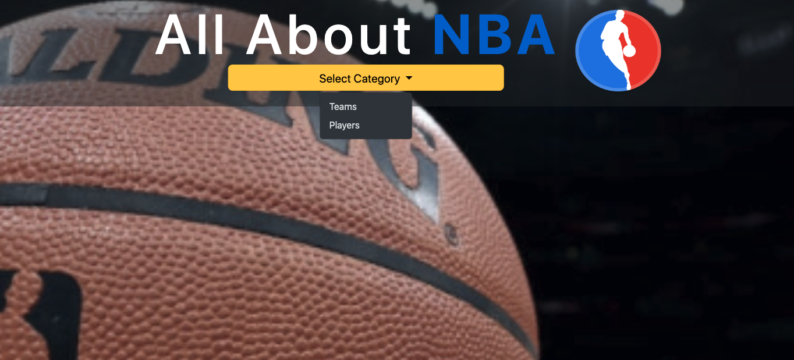
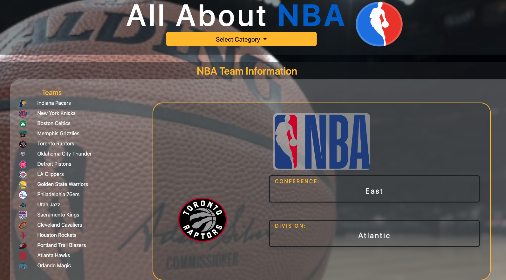
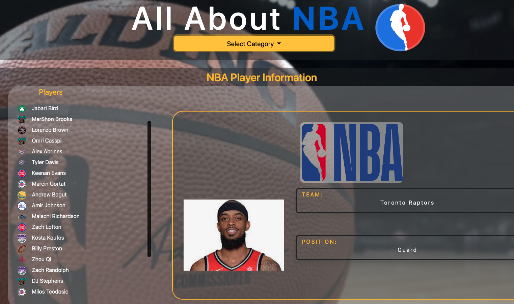

# REST API Project: Team and Player Information

This is a simple REST API project that provides information about basketball teams and some of their players. The API allows users to retrieve details about teams, their rosters, and individual player information.

## Features

- Retrieve a list of basketball teams.
- Get information about a specific team, including its name, location, division and conference.
- Fetch a list of players for a particular team.
- Access player profiles, including their name, position, and statistics.
- Responsive design to cater desktop and mobile devices.

## Usage

To use this API, make HTTP requests to the following endpoints:

- `fetch(https://www.balldontlie.io/api/v1/players)`: Retrieve a list of basketball teams and players information in json format.

## Team Information

The project includes information about basketball teams, including:

- Team name
- Team conference
- Team division
- Team logo (image)

## Player Information

The API provides data on individual players, including:

- Player fullname
- Player position
- Player image

## Technologies Used

- Programming Languages/Libraries: HTML, CSS, Vanilla Javascript and Bootstrap
- Hosting: www.balldontlie.io --- which was provided by a good samaritan :)

## Getting Started

To run this project locally or deploy it on your server, follow these steps:

1. Clone the repository.
2. Start the server.
